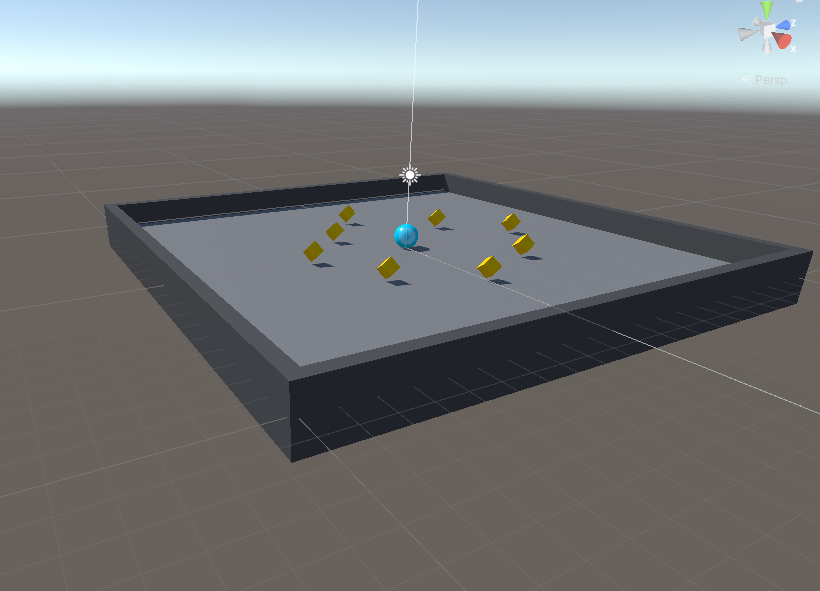
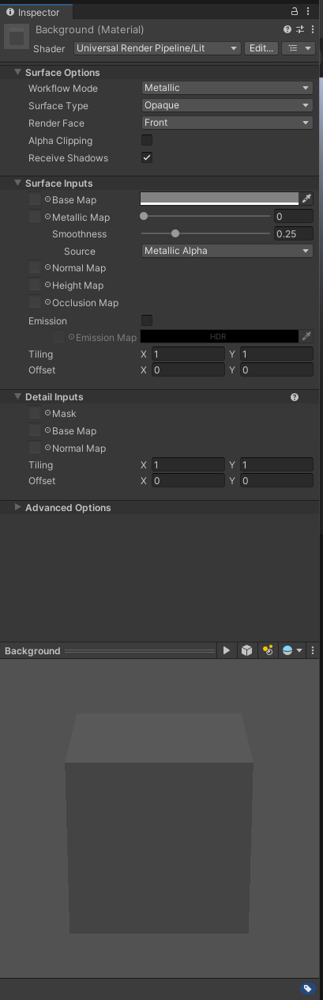
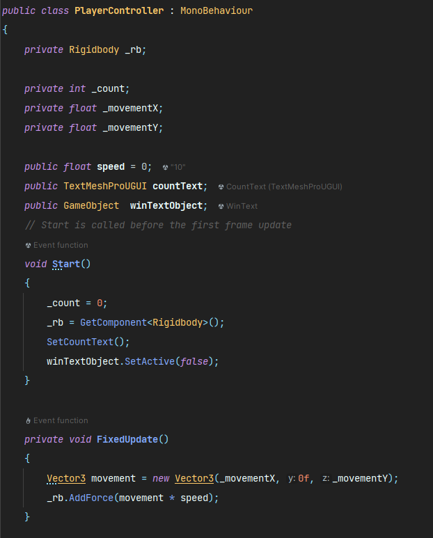
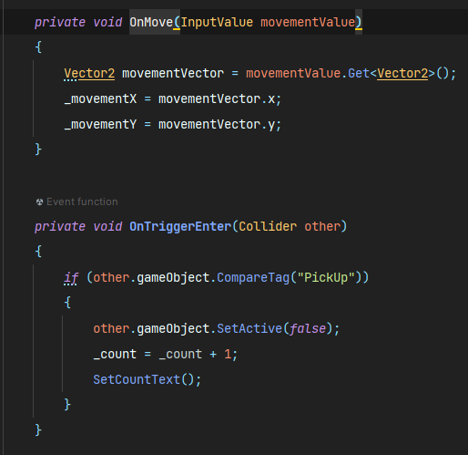
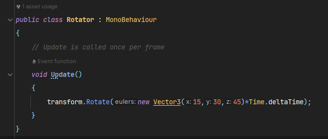
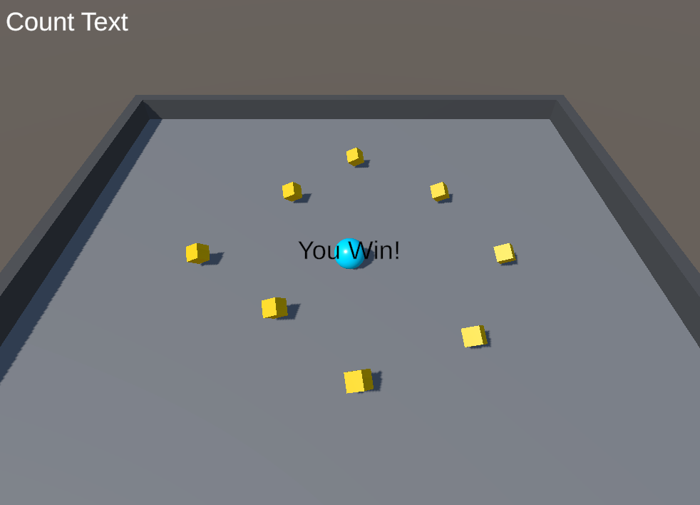

# Setting up the Game

For this project, I used the Unity 2022.3.19f1 engine version and the "3D URP" project template.

I began by creating the Ball as a "Player" and the cubes as "PickUp" objects, as well as the arena, which is made up of a plane for the floor and cubes for the walls.

<p style="text-align: center;">
    
</p>

I used the "Universal Render Pipeline/Lit" to create unique materials for each object.

<p style="text-align: center;">
    
</p>

# Moving the Player

Moving on to building the Player Controller script, I've started with a MonoBehaviour script that will apply a force to Rigidbody (movement * speed, where speed is 0 and movement is the object's location on the plane).

<p style="text-align: center;">
    
</p>

The player's next location will be assigned using the method OnMove, which will obtain from the input system the movementValue.

<p style="text-align: center;">
    
</p>

The function OnTriggerEnter will locate the PickUp objects using the custom Tag "PickUp" and deactivate them, as well as update the UI with the updated score.

## Pick Up Objects

The cubes that the player will pick up will only have a rotation motion, which will be achieved by utilizing the Rotate transform function within the Update method.

<p style="text-align: center;">
    
</p>

# UI (Interface)

For the UI, I utilized two canvas TextMeshPro - Text components to provide a view of the score "Count text" and a message "You Win" if the player collects all of the items in the arena.

<p style="text-align: center;">
    
</p>


Using the code below, the UI will be changed based on the "_count" number, and if the _count is higher than or equal to 8, the win message will be displayed on the screen.

```csharp
private void SetCountText() 
    {
        countText.text =  "Count: " + _count.ToString();

        if (_count >= 8)
        {
            winTextObject.SetActive(true);
        }
        
    }
```